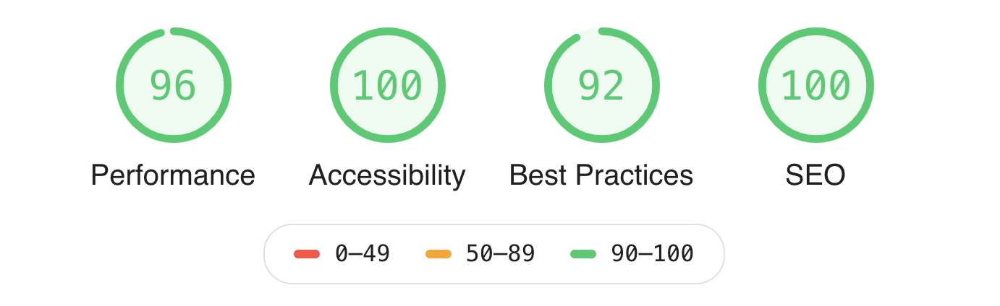

# LocalWeather.io

Minimalist local weather app powered by Dark Sky

## Features

- Progressive Web App
  - ServiceWorker used for caching assets
  - localStorage used to cache API requests in 10 minute intervals
  - App is available when offline or with intermittent connections
    - Automatically checks for new data when back online (or connection stabilizes)
  - Responsive design that scales for all device types
  - App and all assets serverd over HTTPS
  - Can add app to homescreen on mobile devices that support PWAs
  - Latest [Google Lighthouse]([https://developers.google.com/web/tools/lighthouse/) audit ([results](https://lighthouse-dot-webdotdevsite.appspot.com/lh/html?url=https://localweather.io))
    
- Geolocation from browser used for location (latitude/longitude)
  - Uses the [ask permission responsibly](https://developers.google.com/web/fundamentals/native-hardware/user-location/#ask_permission_responsibly) philosophy
    - Let's users know their location info will be used
    - Asks user to initiate process to approve access to location
    - PLANNED: Fall back to IP address geolocation service
- [Google Maps Reverse Geocoding API](https://developers.google.com/maps/documentation/geocoding/start) used to translate lat/lon to friendly name
- Weather data retrieved from [Dark Sky API](https://darksky.net/dev)
- All external API calls consolidated via barebones Node/Express API
  - Alleviates CORS issues
  - Allows for more control with rate limiting
  - Easier to abstract private API keys
  - NOTE: API source currently in private repo, planning to make public in the future
- Background color, favicon, and title are dynamic
  - Background color based on conditions and time of day
    - Clear (Day/Night)
    - Cloudy (Day/Night) - if current cloud cover over 60%
    - Rainy (Day/Night)
    - Snowy (Day/Night)
  - Favicon updates to same as curren conditions on webpage
  - Browser/Tab titlebar text updates to current temp and conditions
- Tooptips provide additional data and information about data types
  - Available via most parts of the interface
    - Hover to display on laptops/desktops
    - Tap/touch to display on mobile devices and tablets
- App automatically checks for updates (if left open)
  - Runs a task every minute, if past the 10 minute cache timeout then data is refreshed
- Uses [Bugsnag](https://bugsnag.com/) for error reporting and release tracking

### Made with

- [npm](https://www.npmjs.com/)
- [Yarn](https://yarnpkg.com/)
- [Webpack](https://webpack.js.org/)
- [Prettier](https://prettier.io/)
- [Eslint](https://eslint.org/)
- [Sass](https://sass-lang.com/)
- [Bulma](https://bulma.io/)
- [Font Aweseome Pro](https://fontawesome.com/pro/)
- [Tippy.js](https://atomiks.github.io/tippyjs/)
- [SweetAlert2](https://sweetalert2.github.io/)
- [Bugsnag](https://www.bugsnag.com/)
- [Netlify](https://www.netlify.com/)

## License

MIT License

Copyright (c) 2019 Michael Sprague

Permission is hereby granted, free of charge, to any person obtaining a copy
of this software and associated documentation files (the "Software"), to deal
in the Software without restriction, including without limitation the rights
to use, copy, modify, merge, publish, distribute, sublicense, and/or sell
copies of the Software, and to permit persons to whom the Software is
furnished to do so, subject to the following conditions:

The above copyright notice and this permission notice shall be included in all
copies or substantial portions of the Software.

THE SOFTWARE IS PROVIDED "AS IS", WITHOUT WARRANTY OF ANY KIND, EXPRESS OR
IMPLIED, INCLUDING BUT NOT LIMITED TO THE WARRANTIES OF MERCHANTABILITY,
FITNESS FOR A PARTICULAR PURPOSE AND NONINFRINGEMENT. IN NO EVENT SHALL THE
AUTHORS OR COPYRIGHT HOLDERS BE LIABLE FOR ANY CLAIM, DAMAGES OR OTHER
LIABILITY, WHETHER IN AN ACTION OF CONTRACT, TORT OR OTHERWISE, ARISING FROM,
OUT OF OR IN CONNECTION WITH THE SOFTWARE OR THE USE OR OTHER DEALINGS IN THE
SOFTWARE.
